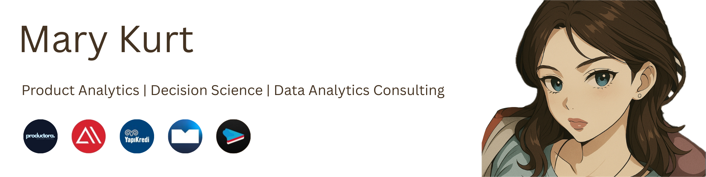

Hey, you found me 
============================================================================================================================

I run [**Productora**](https://www.productora.co/), a one-person product analytics studio powered by AI agents.

I specialize in structuring ambiguous ideas into measurable frameworks not just analyzing data, but designing the questions that drive clarity.

---

### ⚡ What I Do

* Turn business problems into data questions  
* Build structured analytical processes around abstract ideas  
* Discover insights through statistical modeling and behavioral analysis  
* Deliver clarity, not just dashboards

---

### 🛠️ Vibe Engineering

 I practice what's often called [vibe engineering](https://www.productora.co/blog/vibe-coding-to-engineering); building fast, delightful systems that feel as good as they function. My current tools of choice are Next.js, Supabase, and Vercel, and I'm heads-down crafting Second Brain, an AI-native knowledge app. Also a Bun enjoyer.

---

### 🚀 Product Portfolio

#### Second Brain

Second Brain is an AI-powered knowledge platform for polymaths to record daily thoughts, visualize idea networks, and surface deep insights through automatic tagging, voice transcription, and intelligent diagrams with Pro features like AI-powered insights and pattern detection now in early access, email me if you’d like to be added before payment rolls out.

#### Bestseller Analytics

The platform showcases insights from 2024's bestselling fiction and lets users upload manuscripts for chapter-level analysis across emotion, pacing, tension and sensory detail to reveal the story's structure, style and overall impact with a bestseller prediction module coming soon.

#### ETF Analytics

An interactive dashboard that tracks real-time ETF prices, trend history, and AI-powered news sentiment - while surfacing top performers, visualizing risk-return, and comparing category performance over time in a clean, insight-focused interface with additional capabilities coming soon.

#### AutoML Pipeline

The platform allows users to quickly view a profile of their uploaded dataset and visualize it interactively, and for datasets suitable for classification problems, further allows them to identify and download the best-performing model for their prediction target, with regression problem capabilities coming soon.

---

### ✨ Personal Vibe

* Istanbul based, globally curious 
* Highly visual, highly structural mind
* Systems thinking meets first principles, that's how I work

---

### ✉️ Contact Me

* Gmail: [ytu.iremkurt@gmail.com](mailto:ytu.iremkurt@gmail.com)
* LinkedIn: [linkedin.com/in/ytu-iremkurt](https://www.linkedin.com/in/ytu-iremkurt/)

---

### 🧠 Tech Stack

---

### 🎯 GitHub Stats

  

